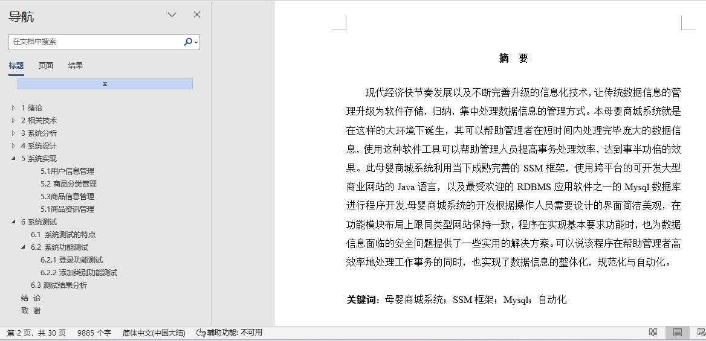
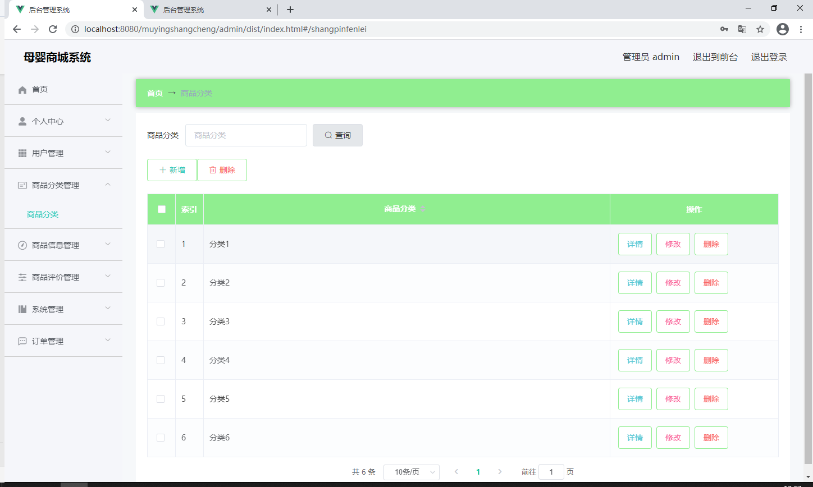
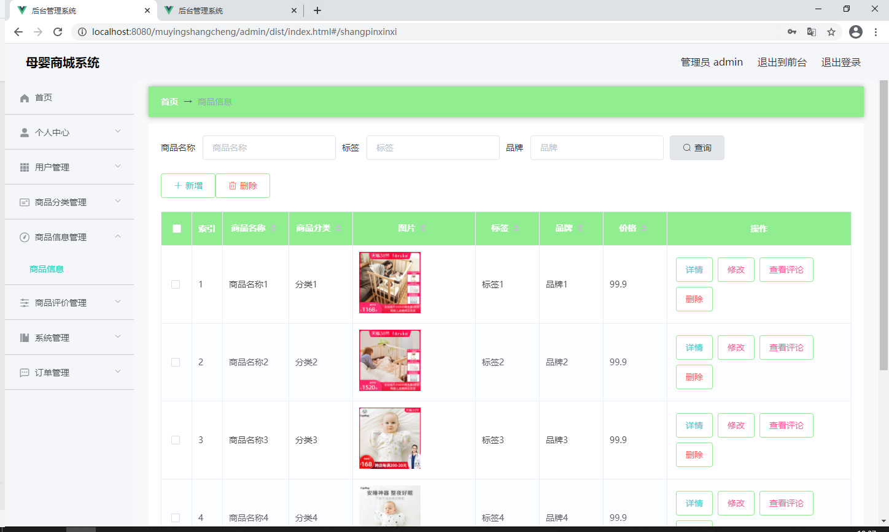
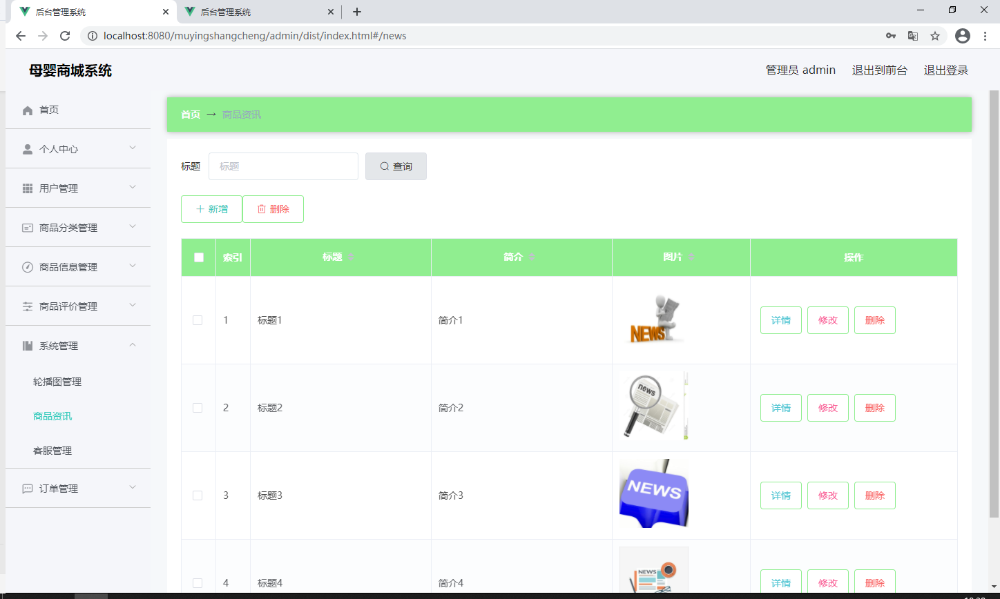
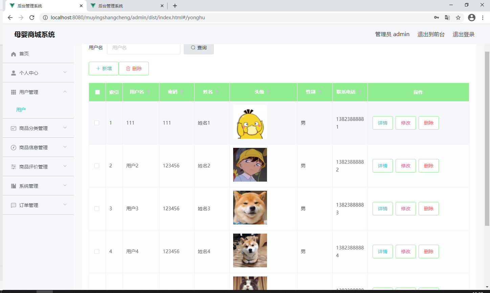

## 母婴商城系统(程序+报告)

- <b>完整代码获取地址：从戎源码网 ([https://armycodes.com/](https://armycodes.com/))</b>
- <b>技术探讨、资料分享，请加QQ群：692619798</b> 
- <b>作者微信：19941326836  QQ：952045282</b> 
- <b>承接计算机毕业设计、Java毕业设计、Python毕业设计、深度学习、机器学习</b>
- <b>选题+开题报告+任务书+程序定制+安装调试+论文+答辩ppt 一条龙服务</b>
- <b>所有选题地址 ([https://github.com/YuLin-Coder/AllProjectCatalog](https://github.com/YuLin-Coder/AllProjectCatalog)) </b>

## 项目介绍
母婴商城系统，包含两种角色：用户、管理员，系统分为前台和后台两大模块，主要功能如下：

1 用户信息管理
用户信息管理页面提供以下功能给管理员：

用户信息查询管理：可以查询用户信息。
用户信息操作：支持删除、修改和新增用户信息。
模糊查询：支持对用户名称进行模糊查询以便于快速定位用户信息。
2 商品分类管理
商品分类管理页面提供以下功能给管理员：

查看商品分类：能够查看已发布的商品分类数据。
商品分类操作：支持对商品分类进行修改和作废操作，作废的分类可以被删除。
3 商品信息管理
商品信息管理页面提供以下功能给管理员：

商品信息查询：能够根据商品名称进行条件查询。
商品数据操作：支持对商品数据进行新增、修改和查询等操作。
4 商品资讯管理
商品资讯管理页面提供以下功能给管理员：

查看商品资讯：能够查看已发布的商品资讯数据。
商品资讯操作：支持修改和作废商品资讯，作废的资讯可以被删除。

## 项目技术
- 编程语言：Java
- 数据库：MySQL
- 项目管理工具：Maven
- 前端技术：HTML、CSS、JavaScript、Vue
- 后端技术：Spring、SpringMVC、MyBatis

## 运行环境
- JDK版本：JDK1.8及以上
- 开发工具：IDEA、Ecplise、Myecplise都可以
- 数据库: MySQL5.7及以上
- Maven：maven3.0及以上
- Node：14.14.0及以上

## 运行截图

